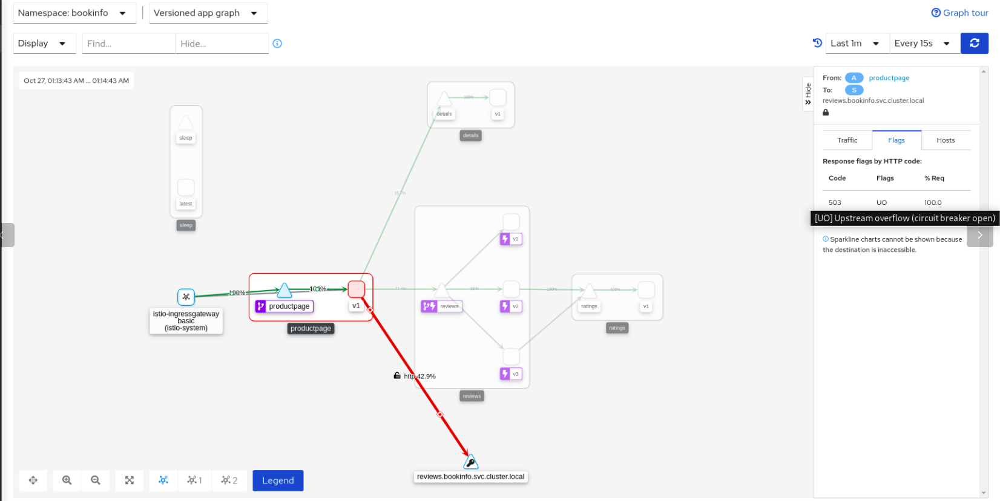
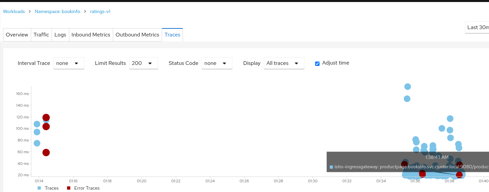

# rhossm-traffic-management
Examples of traffic management using bookinfo application.

## Prerequisites
 - OCP up and running.
 - Openshift Service Mesh installed [Openshift Service Mesh](https://docs.openshift.com/container-platform/4.8/service_mesh/v2x/ossm-about.html).
 <!-- - Egress configured in SMCP [Egress config](ossm-config/basic.yaml). -->

### Deploy Bookinfo application
It is time to deploy the bookinfo sample application. In this use case, only one bookinfo application is deployed in bookinfo project.

Create bookinfo project
```
oc new-project bookinfo
```
Add bookinfo project to Service Mesh
```
oc create -n bookinfo -f ossm/smm.yaml
```

Deploy bookinfo application
```
oc apply -n bookinfo -f https://raw.githubusercontent.com/Maistra/istio/maistra-2.0/samples/bookinfo/platform/kube/bookinfo.yaml
```

#### Exposing the bookinfo application
Get the default ingress domain and replace the $EXTERNAL_DOMAIN variable in _ossm/certs.sh_ and _ossm/certs/cert.conf_ files.

```
oc -n openshift-ingress-operator get ingresscontrollers default -o json | jq -r '.status.domain'
```

Create the certificates.
```
./ossm/certs.sh
```

Client and server certificates should be created under ossm/certs/ folder. Now, create the secret in OCP:
```
oc create secret generic ingress-credential -n istio-system --from-file=tls.key=ossm/certs/server.key --from-file=tls.crt=ossm/certs/server.pem --from-file=ca.crt=ossm/certs/ca.pem
```

Replace the $EXTERNAL_DOMAIN variable in the [Gateway object](./ossm/istio-system/gw-default.yaml), [OpenShift route object](./ossm/istio-system/route-bookinfo.yaml) and [Bookinfo VS object](./ossm/bookinfo/vs-bookinfo.yaml). Create Gateway, Virtual Services, Destination Rules and OpenShift route.
```
oc apply -n istio-system -f ossm/istio-system/gw-default.yaml
oc apply -n istio-system -f ossm/istio-system/route-bookinfo.yaml
oc apply -n bookinfo -f ossm/bookinfo/vs-bookinfo.yaml
oc apply -n bookinfo -f ossm/bookinfo/dr-all-mtls.yaml
```

At this point, the bookinfo application is up and running, but ratings application is consuming the internal database instead of the MySQL deployed previously. The application is accessible from outside the cluster using the ingress gateway.
```
export GATEWAY_URL=$(oc get route bookinfo -n istio-system -o jsonpath='{.spec.host}')
watch -n 1 curl -vI $GATEWAY_URL/productpage

export MTLS_GATEWAY_URL=$(oc get route bookinfo-secure -n istio-system -o jsonpath='{.spec.host}')
watch -n 1 curl -vI https://$MTLS_GATEWAY_URL/productpage  --cacert ossm/certs/ca.pem --cert ossm/certs/client.pem --key ossm/certs/client.key
```

### Deploy and expose the httpbin application
Deploy httpbin application in _bookinfo_ namespace
```
oc process -f httpbin/httpbin.yaml \
    -p HTTPBIN_ROUTE="httpbin.$EXTERNAL_DOMAIN" -p HTTPBIN_ROUTE_SECURE="httpbin.secure.$EXTERNAL_DOMAIN" -n bookinfo \
    | oc apply -n bookinfo -f -
```

Replace the $EXTERNAL_DOMAIN variable in the [OpenShift route object](./httpbin/httpbin-route.yaml) object and in the following command. Create the OCP route.
```
oc process -f httpbin/httpbin-route.yaml \
    -p HTTPBIN_ROUTE_NAME="httpbin" -p HTTPBIN_ROUTE="httpbin.$EXTERNAL_DOMAIN" -p HTTPBIN_ROUTE_SECURE="httpbin.secure.$EXTERNAL_DOMAIN" -p HTTPBIN_REPLICAS=3\
    -n istio-system \
    | oc apply -n istio-system -f -
```

Access the httpbin application
```
export HTTPBIN_GATEWAY_URL=$(oc get route httpbin -n istio-system -o jsonpath='{.spec.host}')
watch -n 1 curl -vI http://$HTTPBIN_GATEWAY_URL/

export SECURE_HTTPBIN_GATEWAY_URL=$(oc get route httpbin-secure -n istio-system -o jsonpath='{.spec.host}')
watch -n 1 curl -vI https://$SECURE_HTTPBIN_GATEWAY_URL/ --cacert ossm/certs/ca.pem --cert ossm/certs/client.pem --key ossm/certs/client.key
```

## Lab 1: Request routing
OpenShift Service Mesh by default routes requests in a round robin manner.

### Route traffic to a specific version
In this lab we will apply the rules to make all requests go to version 2 of reviews so we can see the stars ratings. For that we are going to use the following VirtualService:

```
----
apiVersion: networking.istio.io/v1beta1
kind: VirtualService
metadata:
  name: reviews
spec:
  hosts:
  - reviews
  http:
  - route:
    - destination:
        host: reviews
        subset: v2 <1>
----
```
<1> Note that the only version in the VS is the version 2 of the `reviews` service.

You can see that it refers to something called a subset. This is the way Istio has to call the different versions of a service. You can see the different subsets in the DestinationRules, like the following one for the reviews service:

```
apiVersion: networking.istio.io/v1beta1
kind: DestinationRule
metadata:
  labels:
    template: bookinfo-template
  name: reviews
spec:
  host: reviews
  subsets: (1)
  - labels:
      version: v1
    name: v1
  - labels:
      version: v2
    name: v2
  - labels:
      version: v3
    name: v3
```
<1> As you can see, there are three different subsets that you can reference from a VS.

Route the traffic to the _v2_ subset:
```
oc apply -n bookinfo -f lab1/vs-reviews-v2.yaml
```

Generate traffic and check kiali:
```
export GATEWAY_URL=$(oc get route bookinfo -n istio-system -o jsonpath='{.spec.host}')
watch -n 1 curl -vI $GATEWAY_URL/productpage -I
```

### Route traffic based on headers
Now let’s think that we have a new version for the application and you want to deploy it first to a set of premium users. We are going to see how to do that in this lab where we are going to route the requests from one user in particular to version 3 of the reviews service. For that we are going to use the following VirtualService:
```
apiVersion: networking.istio.io/v1beta1
kind: VirtualService
metadata:
  name: reviews
spec:
  hosts:
  - reviews
  http:
  - match:
    - headers:
        end-user:
          exact: test-user
    route:
    - destination:
        host: reviews
        subset: v3
  - route:
    - destination:
        host: reviews
        subset: v2
```

Route the traffic based on the header defined in the VS:
```
oc apply -n bookinfo -f lab1/vs-reviews-headers.yaml
```

To test it, click on the Sign in button at the top right of the Product Page and login as "test-user", or the user you editted in the yaml if you decided to do that. You have to write it exactly like in the yaml. And you can type whatever you want in the Password field.

Finally, delete the VS used
```
oc delete -n bookinfo vs reviews
```

## Lab 2: Traffic Shifting and Weight Balancing
In this lab you will learn how to gradually migrate traffic from one version of a service to another.


For example, you might migrate traffic from an older version to a new version. In this example you will use reviews:v1 service as the old version and reviews:v2 service as the new version.


First you will deploy Bookinfo and then you will configure a sequence of rules that send 90% of traffic to reviews:v1 and 10% to reviews:v2. Then, you will continue the migration by sending 50% of traffic to each service and, finally, complete the migration sending 100% of the traffic to reviews:v2.


In this lab you will use 2 versions of the same service but you could create more complex routing rules weigth-balancing between many different versions of the same service or even different services.

### Route 10% of the traffic to a new service
The first modification to the _reviews_ VS to add a 90/10 routing rule looks like this:
```
apiVersion: networking.istio.io/v1beta1
kind: VirtualService
metadata:
  name: reviews
spec:
  hosts:
  - reviews
  http:
  - route:
    - destination:
        host: reviews
        subset: v1
      weight: 90 <1>
    - destination:
        host: reviews
        subset: v2
      weight: 10 <2>
```
<1> 90% traffic to _reviews:v1_\
<2> 10% traffic to _reviews:v2_

Note that the sum of weights across destinations should be == 100. If there is only one destination in a rule, the weight value is assumed to be 100.

Apply this configuration:
```
oc apply -n bookinfo -f lab2/vs-reviews-shifting-90-10.yaml
```

### Route half the traffic to each service
The _reviews_ VS to add a 50/50 routing rule will look like this:
```
apiVersion: networking.istio.io/v1beta1
kind: VirtualService
metadata:
  name: reviews
spec:
  hosts:
  - reviews
  http:
  - route:
    - destination:
        host: reviews
        subset: v1
      weight: 50 <1>
    - destination:
        host: reviews
        subset: v2
      weight: 50 <2>
```
<1> 50% traffic to _reviews:v1_\
<2> 50% traffic to _reviews:v2_

Apply this configuration:
```
oc apply -n bookinfo -f lab2/vs-reviews-shifting-50-50.yaml
```

### Route all the traffic to the new service
The _reviews_ VS to add a 100% routing rule to the new service will look like this:
```
apiVersion: networking.istio.io/v1beta1
kind: VirtualService
metadata:
  name: reviews
spec:
  hosts:
  - reviews
  http:
  - route:
    - destination:
        host: reviews
        subset: v1
      weight: 0 <1>
    - destination:
        host: reviews
        subset: v2
      weight: 100 <2>
```
<1> 0% traffic to _reviews:v1_\
<2> 100% traffic to _reviews:v2_

Apply this configuration:
```
oc apply -n bookinfo -f lab2/vs-reviews-shifting-0-100.yaml
```

### Delete VS
Finally, delete the VS used
```
oc delete -n bookinfo vs reviews
```

## Lab 3: Fault Injection
OpenShift Service Mesh has mechanisms to inject faults in your application to test how it will behave when a real fault happens. This is very useful to check if your application’s recovery policies aren’t too restrictive.


In this lab you will inject two different faults in your application. A delay and an abort. Delays are timing failures and aborts are crash failures. You are going to use a similar method than in Lab 1 - Requests Routing when you routed requests using http headers, but this time you are going to inject faults for user "test-user".

### Delay
For the delay you are going to add 7 seconds of delay between the _reviews_ and _ratings_ services, using this VS:
```
apiVersion: networking.istio.io/v1beta1
kind: VirtualService <1>
metadata:
  name: reviews
spec:
  hosts:
  - reviews
  http:
  - route:
    - destination:
        host: reviews
        subset: v2
---
apiVersion: networking.istio.io/v1beta1
kind: VirtualService
metadata:
  name: ratings
spec:
  hosts:
  - ratings
  http:
  - match:
    - headers:
        end-user:
          exact: test-user
    fault:
      delay:
        percentage:
          value: 100.0 <2>
        fixedDelay: 7s <3>
    route:
    - destination:
        host: ratings
        subset: v1 <4>
  - route:
    - destination:
        host: ratings
        subset: v1 <4>
```
<1> In this VS you are setting all traffic to v2 of `reviews` service, since v1 does not have a connection with the `ratings` service.\
<2> This is the percentage in which the fault will be injected. In this case is a 100%.\
<3> This is the delay applied to user "test-user".\
<4> Notice here that you are going to the same destination, but the delay is only for "test-user".

### Abort
Now, for the abort, you will use the following VS:
```
apiVersion: networking.istio.io/v1beta1
kind: VirtualService
metadata:
  name: ratings
spec:
  hosts:
  - ratings
  http:
  - fault:
      abort:
        percentage:
          value: 100.0
        httpStatus: 500 <1>
    route:
    - destination:
        host: ratings
        subset: v1
```
<1> Notice that this time you are always returning an error 500 in the connection between `reviews` and `ratings`.


### Inject delay
Apply the delay:
```
oc apply -n bookinfo -f lab3/vs-delay.yaml
```

Visit the **bookinfo** page and login with the _test-user_ username. You will notice that it will take 7 seconds to load and you will see the following error in the reviews part: "Sorry, product reviews are currently unavailable for this book.".

This happens because there is a hard-coded timeout between _productpage_ service and _reviews_ service of 3 seconds and 1 retry, so a total of 6 seconds. Then, you can’t see the _reviews_ because of this timeout.

### Inject abort
Apply the abort:
```
oc apply -n bookinfo -f lab3/vs-abort.yaml
```

Now you don’t have to be logged in as _test-user_, enter again to your Product Page and now you will see the _reviews_, but the ratings will give you the following error: "Ratings service is currently unavailable". This is because this time the _ratings_ service is returning an error 500.

### Delete VS
Finally, delete the VS used
```
oc delete -n bookinfo -f lab3/vs-delay.yaml
```


## Lab 4: Requests timeouts
A timeout for HTTP requests can be specified using the timeout field in the VS. By default, the timeout is 15 seconds, but in this task you override the _reviews_ service timeout to 1 second.

To see its effect, however, you also introduce an artificial 2 second delay in calls to the _ratings_ service.

### Adding a delay to ratings service
First, route requests to reviews:v2 service (a version that calls the ratings service).
```
apiVersion: networking.istio.io/v1beta1
kind: VirtualService
metadata:
  name: reviews
spec:
  hosts:
  - reviews
  http:
  - route:
    - destination:
        host: reviews
        subset: v2
```

Apply this configuration:
```
oc apply -n bookinfo -f lab4/vs-reviews-v2.yaml
```

Add a 2 second delay to calls to the _ratings_ service:
```
apiVersion: networking.istio.io/v1beta1
kind: VirtualService
metadata:
  name: ratings
spec:
  hosts:
  - ratings
  http:
  - fault:
      delay:
        percent: 100
        fixedDelay: 2s
    route:
    - destination:
        host: ratings
        subset: v1
```

Apply this configuration:
```
oc apply -n bookinfo -f lab4/vs-ratings-delay.yaml
```

Make sure you select _Response Time_ in the Show Edge Labels display options in Kiali. Check the results in Kiali. You may notice a 2 second delay in the ratings call.

If you visit the Bookinfo app with your browser you should see the Bookinfo application working normally (with ratings stars displayed), but there is a 2 second delay whenever you refresh the page.

### Adding a timeout to reviews service
Now add a half second request timeout for calls to the _reviews_ service:
```
apiVersion: networking.istio.io/v1beta1
kind: VirtualService
metadata:
  name: reviews
spec:
  hosts:
  - reviews
  http:
  - route:
    - destination:
        host: reviews
        subset: v2
    timeout: 0.5s
```

Apply this configuration:
```
oc apply -n bookinfo -f lab4/vs-reviews-timeout.yaml
```

By default the request timeout is disabled. Since the _reviews_ service subsequently calls the _ratings_ service when handling requests, you can use Istio to inject a 2 second delay in calls to _ratings_ to cause the _reviews_ service to take longer than half a second to complete and consequently you could see the timeout in action.

You can observe that instead of displaying reviews, the Bookinfo product page (which calls the reviews service to populate the page) display the message: Sorry, product reviews are currently unavailable for this book. This was the result of it receiving the timeout error from the _reviews_ service.

You may have noticed that it returns in about 1 second, instead of 2, and the _reviews_ are unavailable. The reason that the response takes 1 second, even though the timeout is configured at half a second, is because there is a hard-coded retry in the _productpage_ service, so it calls the timing out _reviews_ service twice before returning.

### Delete VS
Finally, delete the VS used
```
oc delete -n bookinfo vs reviews ratings
```

## Lab 5: Circuit Breaking & Outlier Detection
### Circuit Breaking
In this lab you are going to configure circuit breaking for connections. This is very important for building resilient microservices, since it helps to limit the impact of failures and latency spikes.

For this task, we will start by setting a CircuitBreaking in reviews service in order to limit to a single connection and request to it.

Configure this change by executing:
```
oc apply -n bookinfo -f lab5/reviews-only-to-v2-and-cb.yaml
```

To validate that everything works fine with a single connection to that service, run:
```
export GATEWAY_URL=$(oc get route bookinfo -n istio-system -o jsonpath='{.spec.host}')
while true; do curl -s http://$GATEWAY_URL/productpage | grep -i reviews; sleep 0.5 ; done

      <h4 class="text-center text-primary">Book Reviews</h4>
      <h4 class="text-center text-primary">Book Reviews</h4>
      <h4 class="text-center text-primary">Book Reviews</h4>
      ......
```

Notice that 100% of the traffic is succesfully managed by reviews service. In addition, there is a 'ray' icon in the reviews application square that identify the presence of a CB definition.

In details, this is the part of YAML that is set in the DestinationRule that defines this CB:
```
      trafficPolicy:
        connectionPool:
          http:
            http1MaxPendingRequests: 1
            maxRequestsPerConnection: 1
          tcp:
            maxConnections: 1
```

Let’s now generate some load…​ by adding a 10 clients calling out bookinfo app:
```
seq 1 10 | xargs -n1 -P10 curl -s http://$GATEWAY_URL/productpage | grep -i reviews

      <h4 class="text-center text-primary">Book Reviews</h4>
      <h4 class="text-center text-primary">Book Reviews</h4>
      <h4 class="text-center text-primary">Book Reviews</h4>
      <h4 class="text-center text-primary">Error fetching product reviews!</h4>
      <p>Sorry, product reviews are currently unavailable for this book.</p>
      <h4 class="text-center text-primary">Book Reviews</h4>
      <h4 class="text-center text-primary">Book Reviews</h4>
      <h4 class="text-center text-primary">Error fetching product reviews!</h4>
      <p>Sorry, product reviews are currently unavailable for this book.</p>
```

You could see now is that some requests are rejected by the reviews service due to the circuit breaker, both from the test output and from Kiali as well:



### Outlier Detection
In this lab, we are going to discover how an unhealthy pod, which we don't know which one is, it is responding with 5x errors.

First, we need to deploy a custom ratings deployment:
```
oc apply -n bookinfo -f lab5/deploy-ratings.yaml
```

Then, let’s randomly make one pod of our ratings service to fail by executing:
```
oc exec -n bookinfo -c ratings  $(oc get pods -n bookinfo -o NAME | grep ratings | tail -n1) -- curl -s ratings:9080/faulty

{"status":"A ratings pod will start to fail"}
```

And run some tests now. Let’s have a look at the output as there will be some failures comming from an unknown (yet) ratings pod:
```
export GATEWAY_URL=$(oc get route bookinfo -n istio-system -o jsonpath='{.spec.host}')
while true; do curl -s http://$GATEWAY_URL/productpage | egrep "Reviewer1|Reviewer2|Ratings service is currently unavailable"; sleep 0.5 ; done

        <small>Reviewer1</small>
        <small>Reviewer2</small>
        <small>Reviewer1</small>
        <small>Reviewer2</small>
        <small>Reviewer1</small>
        <p><i>Ratings service is currently unavailable</i></p>
        <small>Reviewer2</small>
        <p><i>Ratings service is currently unavailable</i></p>
        <small>Reviewer1</small>
        <small>Reviewer2</small>
        <small>Reviewer1</small>
        <small>Reviewer2</small>
        <small>Reviewer1</small>
        <small>Reviewer2</small>
        <small>Reviewer1</small>
        <p><i>Ratings service is currently unavailable</i></p>
        <small>Reviewer2</small>
        <p><i>Ratings service is currently unavailable</i></p>
```

It is time to make our services mesh more resiliant and see the effect of applying an OutlierDetection policy over ratings service:
```
oc apply -n bookinfo -f lab5/dr-ratings-outlier-detection.yaml
```

What we just applied is:
```
apiVersion: networking.istio.io/v1alpha3
kind: DestinationRule
metadata:
  name: ratings
spec:
  host: ratings
  trafficPolicy:
    outlierDetection:
      baseEjectionTime: 1m (1)
      consecutive5xxErrors: 2 (2)
      interval: 10s (3)
      maxEjectionPercent: 100 (4)
    tls:
      mode: ISTIO_MUTUAL
```

Where:
1. Minimum ejection duration. A host will remain ejected for a period equal to the product of minimum ejection duration and the number of times the host has been ejected. This technique allows the system to automatically increase the ejection period for unhealthy upstream servers.
2. Number of 5xx errors before a host is ejected from the connection pool
3. Time interval between ejection sweep analysis
4. Maximum % of hosts in the load balancing pool for the upstream service that can be ejected.

Once the OutlierDetection has been applied to ratings service, run some tests again. You should notice that there should only be some errors at the begining of the test. Then, after a minute, those errors wil come again.. and then after 2.. and then 3 minutes…​ \
This is the output of the unhealthy pod:
```
10/26/2021, 11:35:21 PM GET /ratings/0
10/26/2021, 11:35:21 PM Internal error: faulty pod
10/26/2021, 11:35:22 PM GET /ratings/0
10/26/2021, 11:35:22 PM Internal error: faulty pod   ---> Outlier detected. Ejected one minute
10/26/2021, 11:36:23 PM GET /ratings/0
10/26/2021, 11:36:23 PM Internal error: faulty pod
10/26/2021, 11:36:24 PM GET /ratings/0
10/26/2021, 11:36:24 PM Internal error: faulty pod
10/26/2021, 11:36:25 PM GET /ratings/0
10/26/2021, 11:36:25 PM Internal error: faulty pod   ---> Outlier detected. Ejected two minutes
10/26/2021, 11:38:34 PM GET /ratings/0
10/26/2021, 11:38:34 PM Internal error: faulty pod
10/26/2021, 11:38:35 PM GET /ratings/0
10/26/2021, 11:38:35 PM Internal error: faulty pod   ---> Outlier detected...
```

This means that the OutlierDetection policy is working as expected because it is evicting the failing pod for a  minute.. then 2.. then 3 and so on. In the real world, this would help the exhausted pod to take some breath and recover by itself (when possible).

And now, it is time to detect wich is the failing pod. To do so I encourage you to use Kiali. For instance, you may go to`workloads`, click on ratings and:

- Validate logs of each pod.
- Identify the wrong pod by using the distributed tracing tooling:



For instance, with this last one, you can click on the red point in the summary of the traces and see the trace details. In these details, try to get the node-id as it will give you some information.


Finally, kill the pod and check that everything goes back to normal.

### Delete lab
Finally, delete the VS used
```
oc delete -n bookinfo -f lab5/
```

## Lab 6: Mirroring and Dark launches
Traffic mirroring, also called shadowing, is a powerful concept that allows feature teams to bring changes to production with as little risk as possible.


Mirroring sends a copy of live traffic to a mirrored service. The mirrored traffic happens out of band of the critical request path for the primary service.


In this lab, you will first force all traffic to reviews:v1 service. Then, you will apply a rule to mirror a portion of traffic to reviews:v2.

### Mirroring traffic to v2
The following VS sends 100% of the traffic to reviews:v1. The last stanza specifies that you want to mirror to the reviews:v2 service:
```
apiVersion: networking.istio.io/v1beta1
kind: VirtualService
metadata:
  name: reviews
spec:
  hosts:
  - reviews
  http:
  - route:
    - destination:
        host: reviews
        subset: v1
      weight: 100
    mirror:
      host: reviews
      subset: v2
    mirrorPercentage:
      value: 10.0 <1>
```
<1> You can use the _mirrorPercentage_ field to mirror a fraction of the traffic, instead of mirroring all requests. If this field is absent, for compatibility with older versions, all traffic will be mirrored. In this example, only the 10% of the traffic will be sent to the mirror service.

When traffic gets mirrored, the requests are sent to the mirrored service with their Host/Authority headers appended with -shadow. For example, cluster-1 becomes cluster-1-shadow.


Also, it is important to note that these requests are mirrored as "fire and forget", which means that the responses are discarded.

Apply this configuration:
```
oc apply -n bookinfo -f lab6/vs-reviews-mirroring.yaml
```

Now, in the istio-proxy of _reviews-v2_ pod you will find requests from this mirror configuration. Check that authority field is set as _reviews-shadow:9080_.

### Delete VS
Finally, delete the VS used
```
oc delete -n bookinfo -f lab6/vs-reviews-mirroring.yaml
```

## Cleanup
### Bookinfo
Remove bookinfo application
```
oc delete -n bookinfo -f https://raw.githubusercontent.com/Maistra/istio/maistra-2.0/samples/bookinfo/platform/kube/bookinfo.yaml
```

Remove bookinfo project to Service Mesh
```
oc delete -n bookinfo -f ossm/smm.yaml
```

Delete bookinfo project
```
oc delete project bookinfo
```

Delete ingress credential
```
oc delete secret ingress-credential -n istio-system
```

Delete OCP routes
```
oc delete route bookinfo -n istio-system
oc delete route bookinfo-secure -n istio-system
oc delete route httpbin -n istio-system
oc delete route httpbin-secure -n istio-system
```